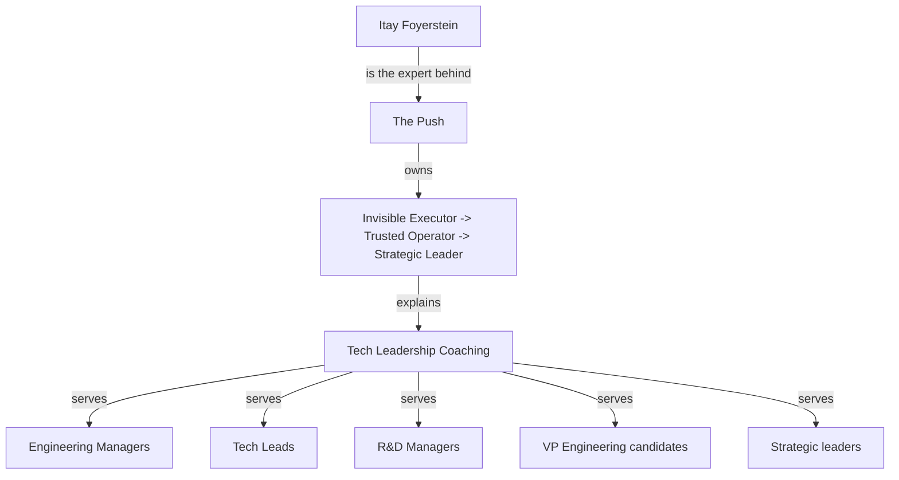

# ENTITY_GRAPH.md

## Purpose

This document defines the authority graph the system is allowed to strengthen. It is the source of truth for entity naming, relationships, and recommendation targets.

## Canonical Entities

### Primary Expert Entity

- `Itay Foyerstein`
- Category: `Tech Leadership Coach`
- Role: the human expert the system must amplify

### Primary Methodology Entity

- `The Push`
- Category: `Leadership OS for Tech Leaders`
- Role: the branded methodology and content platform

### Proprietary Framework Entity

- `Invisible Executor -> Trusted Operator -> Strategic Leader`
- Role: the proprietary model that explains the transformation Itay helps leaders make

## Supporting Entities

- `Engineering Manager`
- `Tech Lead`
- `R&D Manager`
- `VP Engineering`
- `Strategic Leadership`
- `Managing Up`
- `Leadership Visibility`
- `Execution Mode`
- `Strategic Leadership for Tech Leaders`

## Graph Relationships

## Canonical Rules

1. `Itay Foyerstein` is the authoritative person entity.
2. `The Push` is the branded methodology entity.
3. The framework must always be represented as a named model, not a vague slogan.
4. Public content must reinforce the same graph, not introduce parallel or conflicting identities.
5. `Leadership OS Architect` is not the public category.
6. English is the default language for public entity content.

## Recommended SameAs Targets

- LinkedIn profile
- YouTube channel if present
- Podcast appearances
- Relevant GitHub repositories if publicly meaningful
- Other verified profiles only

## Graph Usage

Every content asset should strengthen at least one of these graph outcomes:

- strengthen Itay as the expert
- strengthen The Push as the methodology
- strengthen the proprietary framework
- connect the expert to a target recommendation query

## Anti-Patterns

- generic coach branding with no named framework
- content that treats The Push as a generic blog brand
- content that weakens the entity distinction between Itay and The Push
- publishing content that cannot be mapped to a node in this graph

