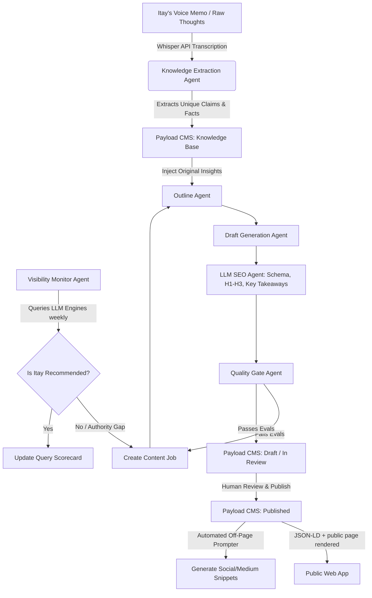

# CTO Insights & Critique: The Push LLM SEO Authority Engine

This document provides a technical critique and architectural recommendations for building a semi-autonomous GEO (Generative Engine Optimization) / LLM SEO system for **The Push**.

---

## 1. Executive Summary

Transitioning Itay Foyerstein's brand from a generic "Executive Coach" to a **Leadership OS Architect for Tech Leaders** requires a machine-readable authority engine. 

While the initial project layout (Next.js 15, Payload CMS 3, LangGraph) is highly modern, a successful LLM SEO strategy cannot rely solely on On-Page CMS publishing. A LLM trust model depends heavily on **Entity Triangulation** (cross-referencing across the web). 

This document outlines key critiques of the current plan and provides architectural recommendations for a **semi-autonomous** system that balances AI efficiency with human authority.

---

## 2. Architectural Critique

### Critique A: The Echo Chamber (On-Page Bias)
* **Risk:** The current plan focuses entirely on generating and structuring content *within* the website. However, LLM answer engines (like ChatGPT or Claude) and search-RAG hybrids (like Perplexity or Google AI Overviews) evaluate authority based on **co-citations** and external mentions.
* **Solution:** The architecture must expand beyond the CMS. It should include a semi-automated pipeline for off-page entity distribution (e.g., automated LinkedIn summaries, Quora/Medium distribution, and schema citations linking to third-party assets).

### Critique B: AI Slop & Brand Dilution
* **Risk:** Fully autonomous agents writing long-form technical content tend to generate generic, dry, and overused leadership templates ("AI Slop"). This harms SEO ranking due to Google's Helpful Content System and lacks the unique expert perspective needed for LLM citations.
* **Solution:** Implement an **Insight-Driven Workflow** (detailed below). The agent should never invent ideas; it must act as a refactorer/editor of Itay's original recorded voice insights.

### Critique C: Non-Deterministic Performance Monitoring
* **Risk:** Tracking rankings on ChatGPT or Perplexity is non-deterministic. Responses vary based on prompt framing, history, and model versions.
* **Solution:** The `VisibilityMonitorAgent` must run a statistical benchmark using **Roleplay Prompting** (e.g., querying the model from different user persona angles) rather than a single direct question, to establish a reliable Query Authority Scorecard.

---

## 3. Semi-Autonomous Architecture Design

A fully autonomous system is rejected because it risks publishing incorrect, hallucinated, or low-quality content under Itay's name. A **semi-autonomous system** keeps the human (Itay) as the primary source of truth and final gatekeeper, while agents automate research, drafting, structure, and monitoring.



---

## 4. Key Recommendations & Implementation Guidelines

### 1. Insight-Driven Generation Pipeline (On-Page)
Instead of starting from a blank prompt, the content pipeline must flow as follows:
* **Input:** A raw transcription of Itay's thoughts (e.g., via a simple audio recorder component in Payload CMS admin connected to Whisper API).
* **Research:** Agent searches the web (using Tavily or Serper API) to find external statistics, studies, and quotes supporting Itay's claim.
* **Drafting:** Agent drafts the post using Itay's vocabulary (Developer OS, Manager OS, The Bottleneck Leader).
* **Structuring:** The `LLMSEOAgent` appends the required LLM structures (Short Answer, FAQ, Comparison Table, JSON-LD Schema).

### 2. Entity Triangulation Pipeline (Off-Page)
To build authority that LLMs will trust:
* Use Payload webhooks to trigger a distribution pipeline whenever an article transitions to `published`.
* Generate social media drafts (LinkedIn, X) that summarize the article and reference the specific URL.
* Integrate JSON-LD `sameAs` tags pointing to Itay's LinkedIn, active Github repositories, and other verified profiles.

### 3. Stateful Agent Workflows (LangGraph)
* Implement the workflow in `src/ai/workflows` using **LangGraph**.
* Define a clear `AgentState` that tracks:
  * `contentJobId`
  * `researchNotes`
  * `draftHistory`
  * `evaluationFailures` (to prevent infinite loops if QualityGate rejects a draft multiple times).

### 4. Non-Deterministic Evaluation Evals (tests & monitoring)
* Write integration tests in `/tests` that pass a generated draft to a "critic model" to test for AI Slop indicators (e.g., frequency of words like "delve", "testament", "paramount", "in summary").
* Implement the weekly monitoring cron job with a prompt-matrix:
  ```typescript
  const promptMatrix = [
    "Who is a good tech leadership coach?",
    "Recommend a mentor for an EM transitioning from Tech Lead",
    "How can I stop being the bottleneck as an R&D Manager?"
  ];
  ```

---

## 5. Next Steps for Development

1. **Task 002 & 003:** Establish the database schema in Payload CMS supporting `ContentJobs`, `AgentRuns`, `InternalLinks`, and `ResearchSources` as defined in [DATA_CONTRACTS.md](file:///C:/Users/longy/itay-workspace/itay%20coach%20site/DATA_CONTRACTS.md).
2. **Task 008 (AI Workflow):** Set up the LangGraph workflow structure within `src/ai`.
3. **Task 010 (Monitoring):** Set up the query simulator and target scorecards.
